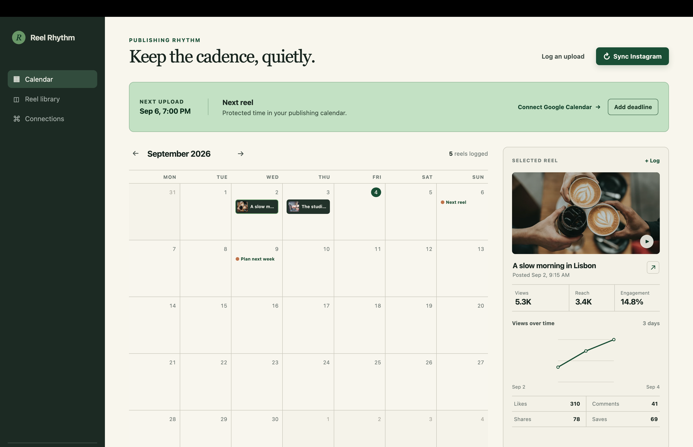

# Reel Rhythm

A private publishing tracker for one Instagram creator. It syncs your reels, keeps a
day-by-day record of how each one performs, and lays the whole thing out on a calendar
so the next upload has a place to land.



## Why

Creator dashboards optimise for engagement with the dashboard. This one optimises for
answering three questions and then getting out of the way: *what did I post, how is it
doing, and what is next?* The calendar leads, because cadence is the habit that matters.
Metrics are shown as a trend over days rather than a wall of numbers, because a reel's
story is how it moves, not where it landed.

## What it does

- **A publishing calendar** as the primary surface, with multiple uploads per day
- **Per-reel analytics history** — every sync writes a dated snapshot, so you see views,
  reach and engagement accumulate rather than just today's figure
- **Deadlines that reach your real calendar** — creates a Google Calendar event with
  reminders 24 hours and 1 hour ahead, and folds edits made in Google back in
- **Manual logging** for a reel posted before its sync arrives
- **Password-gated**, because it holds your calendar and your analytics

## How it works

A single Next.js App Router application. There is no separate backend: the route handlers
under `app/api` are the server, deployed as serverless functions.

```
app/
  page.tsx              calendar, reel detail, deadline + manual entry forms
  login/                the password gate's sign-in page
  api/
    dashboard/          read the tracker, log a reel manually
    instagram/sync/     pull media + insights from the Graph API
    calendar/           create deadlines, reconcile them against Google
    google/             OAuth start and callback
    auth/               sign in, sign out
lib/
  storage.ts            Upstash Redis, with a health check
  dashboard.ts          the stored shape, and how a sync folds into it
  google.ts             OAuth tokens, event creation, reconciliation
  instagram.ts          paginated media fetching, bounded concurrency
  time.ts               anchoring typed wall-clock times to a real instant
  auth.ts               signed session cookies
middleware.ts           the gate every data route sits behind
```

State lives in Upstash Redis under two keys — the dashboard and the Google tokens. There
is no user table, because there is one user.

## Decisions worth explaining

A few things here are deliberate, and were not obvious at first:

**Times are anchored to the browser's zone, not the server's.** A `datetime-local` input
produces a naive wall-clock string, and `new Date()` resolves that against whatever zone
the server runs in — UTC on Vercel. A deadline typed as 11:45 in London became 11:45Z and
appeared an hour late. The browser now sends its IANA zone and `lib/time.ts` resolves the
offset twice, so a time near a daylight-saving boundary uses the offset in force at the
answer rather than the one at the guess.

**A sync folds into stored reels rather than replacing them.** The media edge returns one
page at a time, so treating a response as the complete library silently deleted older
reels along with the metric history built up for them. Syncs now match on Instagram's
media id, and pagination keeps the older reels updating rather than merely surviving.

**A failed measurement is not a measurement of zero.** When an insights request fails, the
reel keeps the history it has. Recording zeros would write a snapshot of nothing as though
it were real, and overwrite the true reading taken earlier that day.

**Only a positive signal deletes.** Reconciling deadlines against Google removes one only
on a 404, a 410, or a `cancelled` status. A rate limit, an outage or a dropped connection
leaves the deadline alone, because a transient failure must never be mistaken for an
intentional deletion.

**Production fails closed.** If `APP_PASSWORD` is unset, a production deployment refuses to
serve rather than falling open and exposing the calendar to anyone holding the URL.

## Running it

```bash
npm install
cp .env.example .env.local
npm run dev
```

It starts with sample data, so the interface is usable before either integration is
connected. Development runs without a password; production requires one.

## Configuration

| Variable | Purpose |
| --- | --- |
| `APP_PASSWORD` | Gates every data route. Required in production. |
| `UPSTASH_REDIS_REST_URL` / `_TOKEN` | Durable storage. Vercel's Upstash integration supplies `KV_REST_API_URL` / `KV_REST_API_TOKEN` instead, and either pair works. |
| `INSTAGRAM_ACCESS_TOKEN` | Instagram Graph API token for a Professional Creator or Business account. |
| `GOOGLE_CLIENT_ID` / `GOOGLE_CLIENT_SECRET` | OAuth client with the Calendar API enabled. |

`.env.example` documents the rest, including the sync's tuning knobs.

### Getting the credentials

Four things to obtain. Budget half an hour the first time; most of it is account admin
rather than anything technical.

#### 1. A password

Any long random string. You paste it once and the browser holds the session for 30 days.

```bash
openssl rand -base64 24
```

Set it as `APP_PASSWORD`. Production refuses to start without one.

#### 2. Upstash Redis

The simplest route is through Vercel: open your project, go to **Storage**, and add
**Upstash Redis** from the marketplace. It writes `KV_REST_API_URL` and
`KV_REST_API_TOKEN` into your environment for you, and the app reads those.

To create one directly instead, sign up at [console.upstash.com](https://console.upstash.com),
create a Redis database, and copy the **REST** URL and token from the database page into
`UPSTASH_REDIS_REST_URL` and `UPSTASH_REDIS_REST_TOKEN`. Take the `https://` REST endpoint,
not the `rediss://` connection string — the client speaks Upstash's REST protocol, and the
TCP URL will not work.

#### 3. Instagram access token

Your Instagram account must be **Professional** (Business or Creator). Switch it in the
Instagram app under *Settings → Account type and tools*. Personal accounts have no API
access at all.

1. Go to [developers.facebook.com](https://developers.facebook.com) and create an app.
2. Add the **Instagram** product, then open **Instagram → API setup with Instagram
   business login** in the left menu.
3. Add your Instagram account, then press **Generate token** beside it and complete the
   Instagram login.
4. Copy the token into `INSTAGRAM_ACCESS_TOKEN` and leave
   `INSTAGRAM_API_MODE=instagram-login`.

> **These tokens last 60 days.** Tokens generated in the App Dashboard are long-lived but
> not permanent, so syncing will start failing roughly two months after setup. Regenerate
> the token and update the variable when it does. (Tokens obtained through the login flow
> rather than the dashboard last only an hour, so use the dashboard button.)

Meta's older Facebook Page-token route still works: set
`INSTAGRAM_API_MODE=facebook-login` and add `INSTAGRAM_BUSINESS_ACCOUNT_ID`.

#### 4. Google OAuth client

1. In [console.cloud.google.com](https://console.cloud.google.com), create a project.
2. **APIs & Services → Library**, search for **Google Calendar API**, and enable it.
3. **APIs & Services → OAuth consent screen**: choose **External**, fill in the app name
   and your support email, and add your own Google account under **Test users**.
4. **APIs & Services → Credentials → Create credentials → OAuth client ID**, type
   **Web application**. Under *Authorised redirect URIs* add both:
   - `http://localhost:3000/api/google/callback`
   - `https://your-domain/api/google/callback`
5. Copy the client ID and secret into `GOOGLE_CLIENT_ID` and `GOOGLE_CLIENT_SECRET`.

> **Set the publishing status to "In production", or the connection breaks weekly.** While
> an external app's status is **Testing**, Google issues refresh tokens that expire after
> **7 days**, so the calendar silently disconnects every week and has to be reconnected by
> hand. The exemption to that rule covers only the basic profile scopes, not
> `calendar.events`. Publishing the app removes the expiry; an unverified app still shows a
> "Google hasn't verified this app" screen you can click past, which is fine for a tool
> only you sign in to.

The app requests `calendar.events` and nothing else. Tokens are stored server-side and
refreshed automatically.

## Deploying

Import the repository into Vercel, add the Upstash Redis integration, and set the
variables above. Redeploy after adding each integration.

## Known limitations

- **Single tenant by design.** One password, one set of stored credentials. Multi-user
  would mean per-user keys and real accounts.
- **Calendar reconciliation is pull-based.** Google's edits are folded in when the app
  loads, not pushed. Live updates would need `events.watch` channels, a public callback,
  and periodic renewal.
- **Sync cost grows with the library.** Every reel costs an insights call, so very large
  libraries should refresh a slice per sync rather than everything at once.

## Licence

Apache 2.0 — see [LICENSE](LICENSE).
